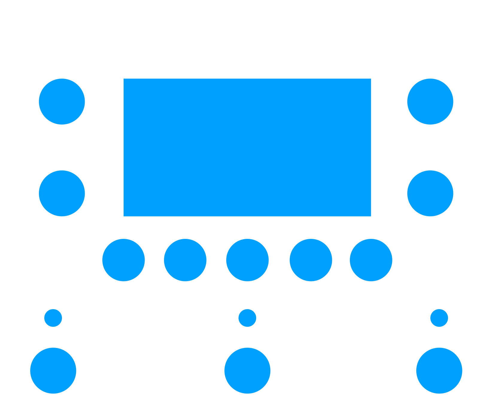

# 🎛 LCD EQ Pedal

## User Interface

The drill template for the pedal currently looks like this:

Big 128x64 pixel LCD in the center.
Treble, middle, bass, volume pots left and right of the display and 5 pushbuttons beneath.
The pedal is controlled by 3 footswitches.
